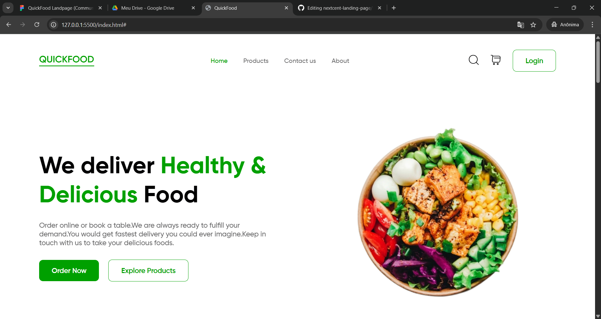

    <h1>🥞 QuickFood Landscape 🥞</h1>

Landing page com HTML e CSS

    <a href="#-o-que-é">O que é?</a> |
    <a href="#-descrição">Descrição</a> |
    <a href="#-tecnologias">Tecnologias</a> |
    <a href="#-autor">Autor</a>

---

## ❓ O que é

Um projeto feito com HTML e CSS, a partir de um design no Figma, aplicando estilos globais, animações e estruturação de código.

[Design](https://www.figma.com/design/6kUvmt6c2UIgiXOtczkyFT/QuickFood-Landpage--Community-?node-id=0-1&p=f&t=5Hw4sghXrofTTDTP-0)

---

## 📃 Descrição

### <code>Linguagens</code>

- **HTML**
- **CSS**

### <code>Estruturação de pastas</code>

- src

  - assets

    - fonts
    - imgs
      - icons
      - logos

  - styles

- index.html

### <code>Layout</code>

### <code>Como rodar</code>

1. Navegue à pasta do projeto
2. Abra o <code>index.html</code>
3. Use o Live Server do VScode (atalho <code>Alt + L / Alt + O</code>)

---

## 📱 Tecnologias

---

## 👨‍💻 Autor

Felipe Ferreira Lima, estudante de programação front-end

